# LAMP STACK IMPLEMENTATION
## LAMP-Linux, Apache, Mysql and PHP(Could be python or perl also)

### EC2 INSTANCE SETUP
- Launch an instance
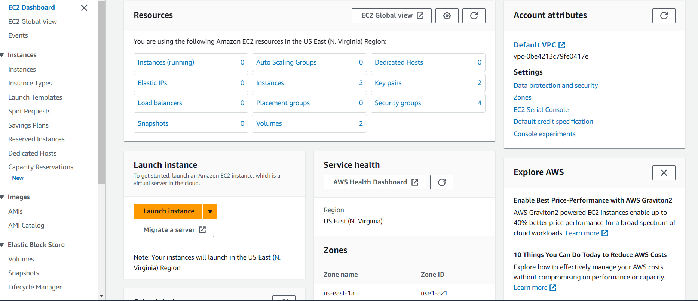
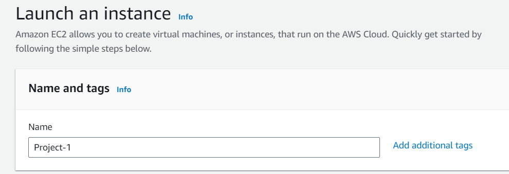
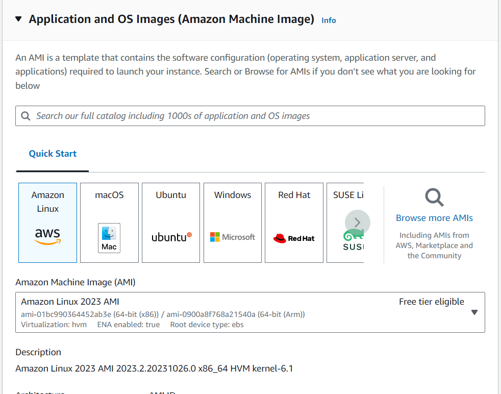
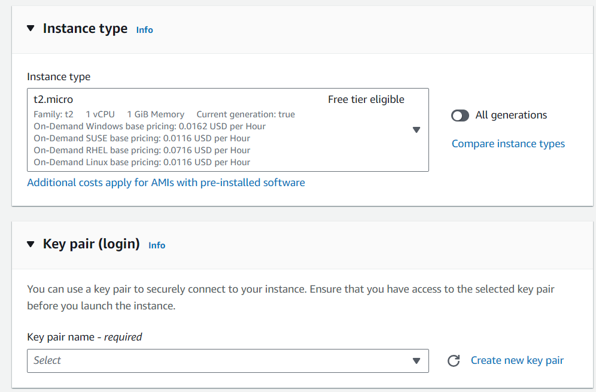

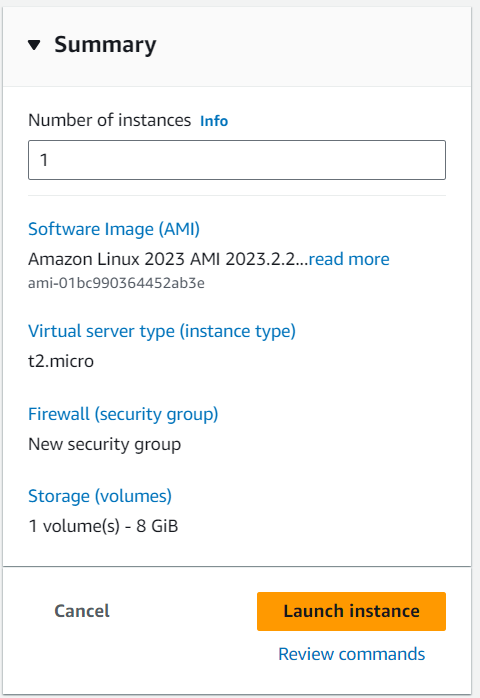
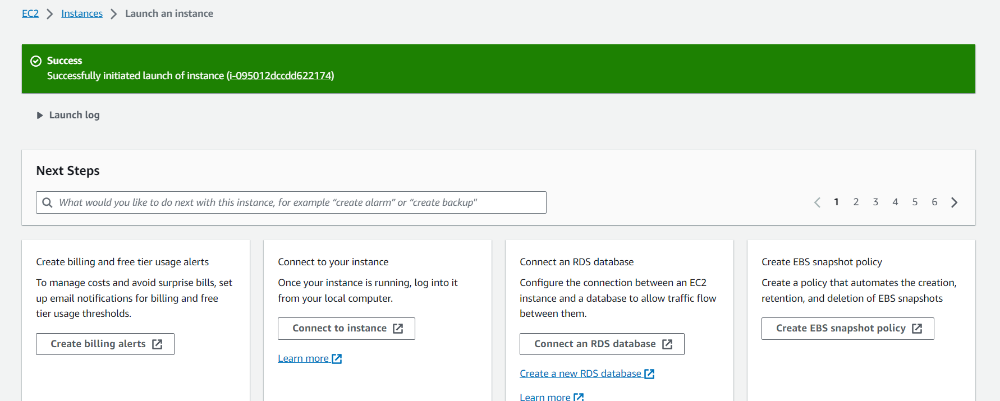

1. Connect your EC2 Instance via ssh 
    - Copy your ssh connect command from your aws console
    - 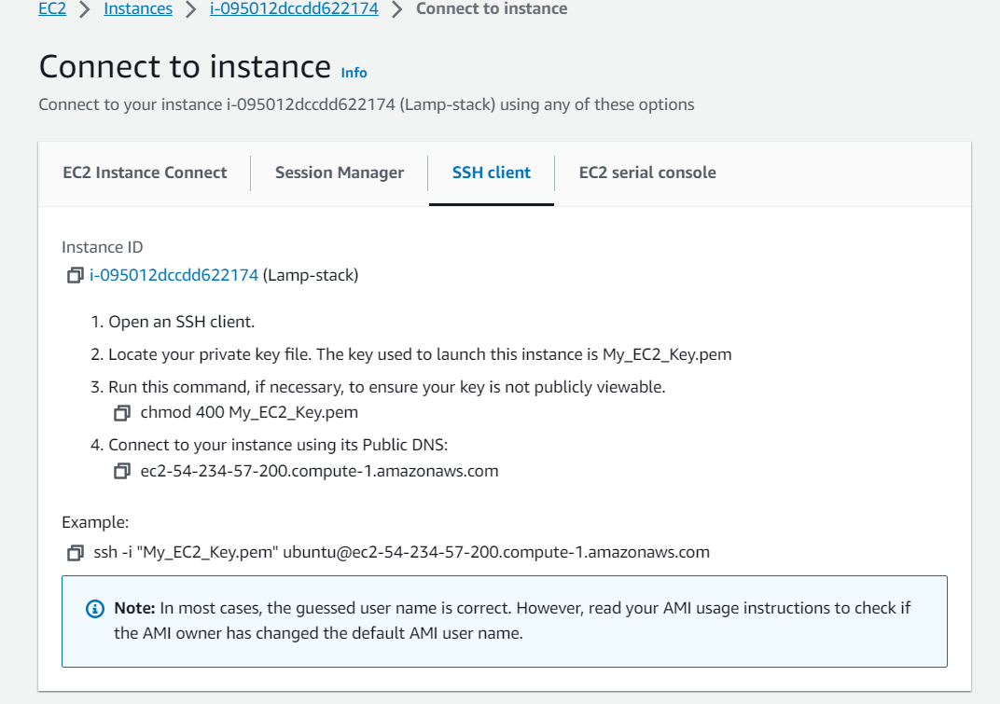
2. Pick any terminal of your choice and ssh into your instance
    - Make sure you are in the right directory where your pem file is located
    - 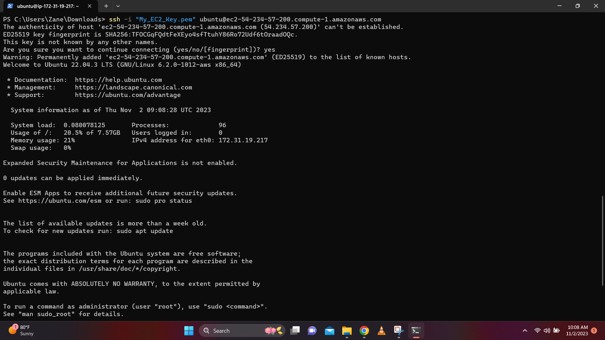
3. Run this commands:
   - `sudo apt update` To update the list of packages in your packet manager
   - 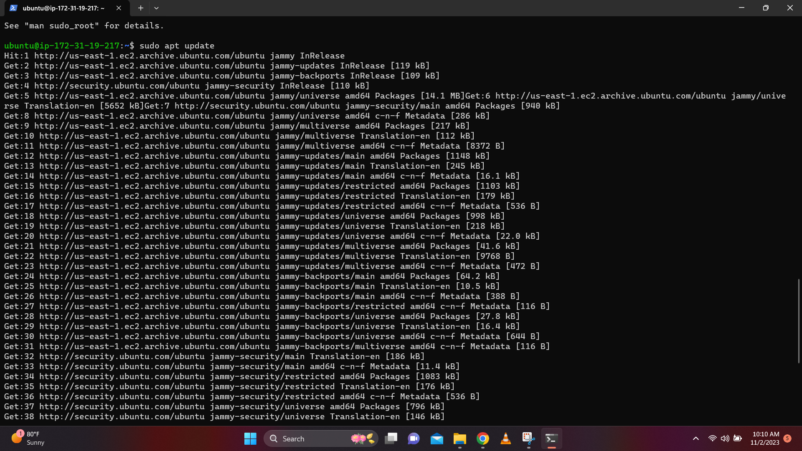
   - 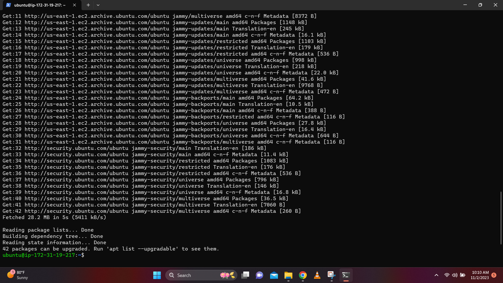
    - `sudo apt install apache2` Install apache2
    - 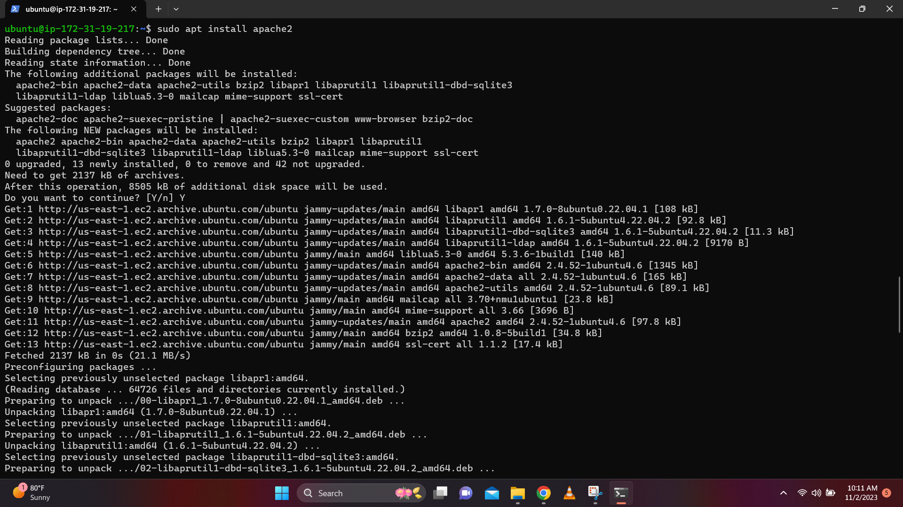
    - `sudo systemctl status apache2` Verify your installation
    - 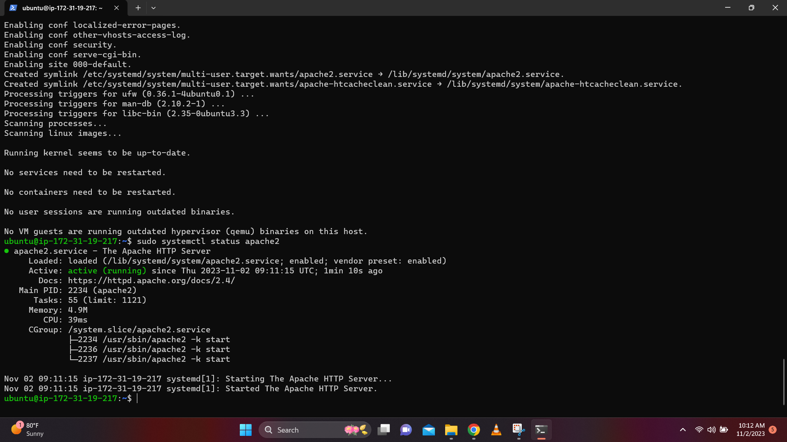
    - `curl http://localhost:80` To check if our server is running and we can access it locally and from the Internet
    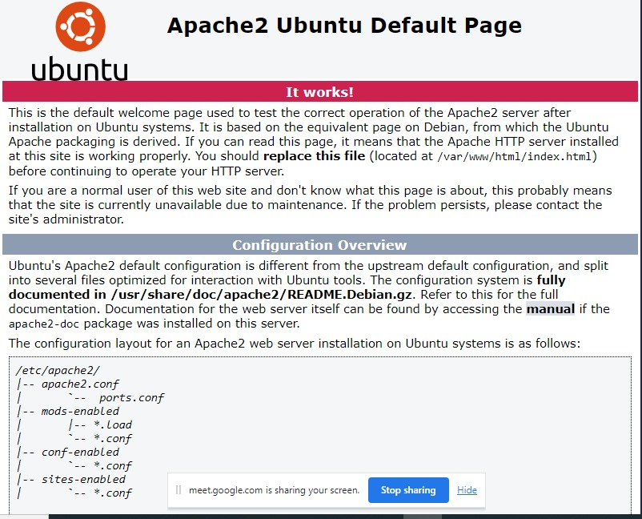
4. Install MYSQL
    - Run the following commands one after the other;
        - To install mysql server and login into it
    ```
    sudo apt install mysql-server
    sudo mysql
    ```
    - It’s recommended that you run a security script that comes pre-installed with MySQL. This script will remove some insecure default settings and lock down access to your database system. Before running the script, you will set a password for the root user, using mysql_native_password as default authentication method. We’re defining this user’s password as PassWord.1

    ```
    mysql> ALTER USER 'root'@'localhost' IDENTIFIED WITH mysql_native_password BY 'PassWord.1';
    mysql> exit
    ```
    - Start the interactive script by running: 
        -  `sudo mysql_secure_installation`
    - Answer Y for yes, or anything else to continue without enabling.
    - NOTE: Press y|Y for Yes, any other key for No:
If you answer “yes”, you’ll be asked to select a level of password validation. Keep in mind that if you enter 2 for the strongest level, you will receive errors when attempting to set any password which does not contain numbers, upper and lowercase letters, and special characters, or which is based on common dictionary words e.g., 'PassWord.1'
For the rest of the questions, press Y and hit the ENTER key at each prompt. This will prompt you to change the root password, remove some anonymous users and the test database, disable remote root logins, and load these new rules so that MySQL immediately respects the changes you have made.
- Login to mysql server with;
    - `sudo mysql -p`
5. Install php
    - `sudo apt install php libapache2-mod-php php-mysql`
    - 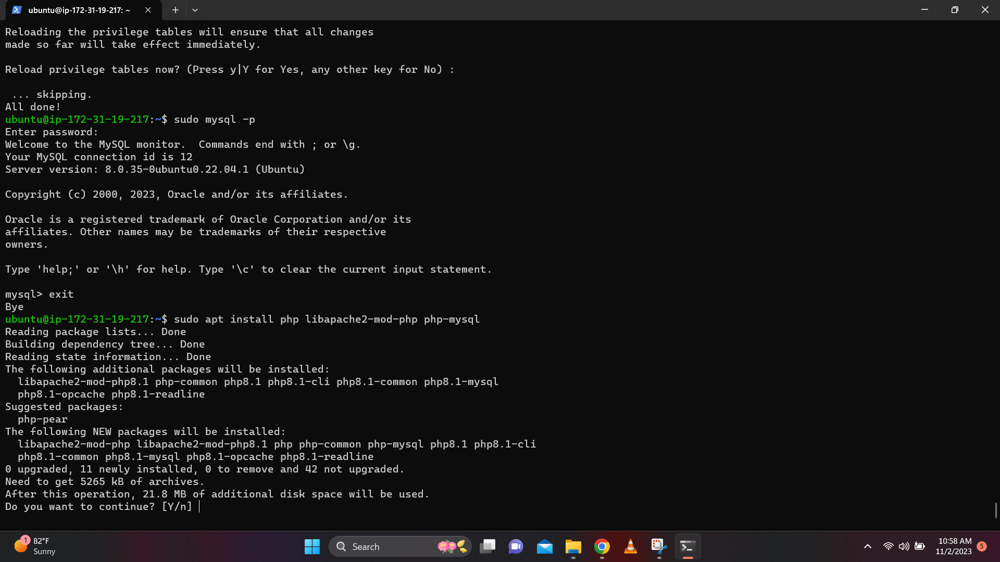
    - `php -v` Verify installation and version
    - 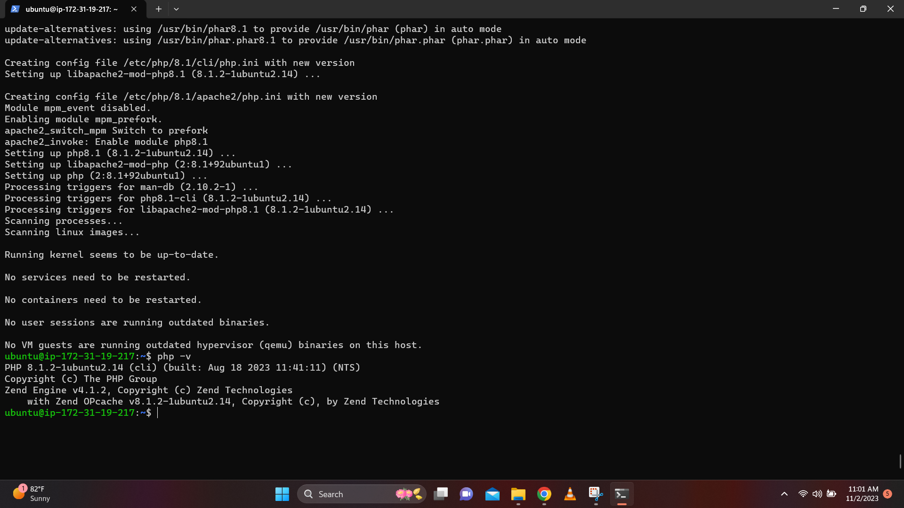
    - At this point, our LAMP stack is completely installed and fully operational.
6. Create a virtual host for your lamp stack
    - Create the directory for projectlamp using ‘mkdir’ 
    `sudo mkdir /var/www/projectlamp`
    - Next, assign ownership of the directory with our current system user
    `sudo chown -R $USER:$USER /var/www/projectlamp`
    - Create and open a new configuration file in Apache’s sites-available directory using your preferred command-line editor
    `sudo nano /etc/apache2/sites-available/projectlamp.conf`
    - This will create a new blank file. Paste in the following configuration text:
    ```
    <VirtualHost *:80>

    ServerName projectlamp

    ServerAlias www.projectlamp

    ServerAdmin webmaster@localhost

    DocumentRoot /var/www/projectlamp

    ErrorLog ${APACHE_LOG_DIR}/error.log

    CustomLog ${APACHE_LOG_DIR}/access.log combined

    </VirtualHost>

    ```
    - Check the sites directory
    `sudo ls /etc/apache2/sites-available`
    - Enable the virtual host
    `sudo a2ensite projectlamp`
    - You might want to disable the default website that comes installed with Apache. This is required if you’re not using a custom domain name, because in this case Apache’s default configuration would overwrite your virtual host.
    `sudo a2dissite 000-default` 
    - To make sure your configuration file doesn’t contain syntax errors 
    `sudo apache2ctl configtest`
    - To reload the apache server because of the previous changes
    `sudo systemctl reload apache2`
    - 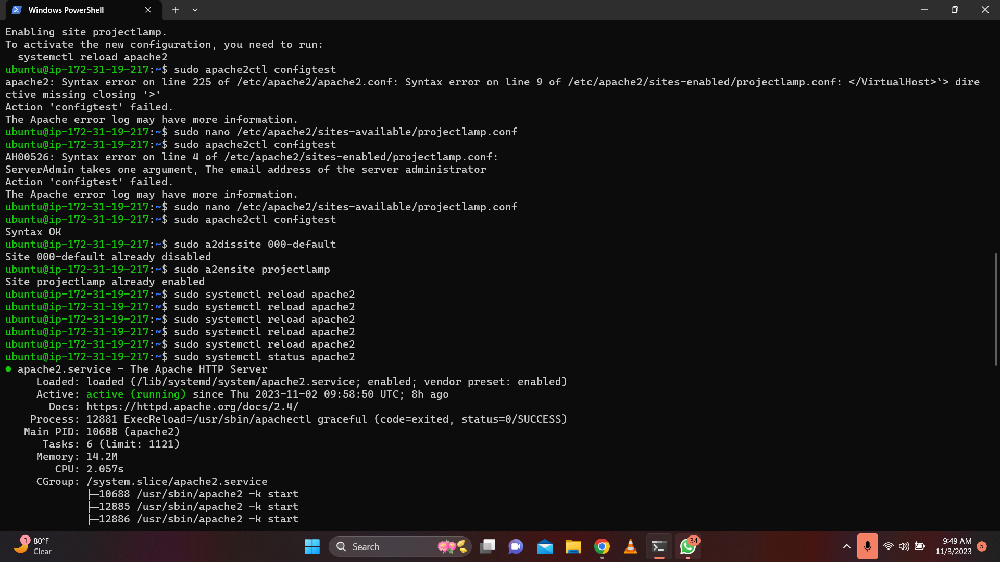
    - 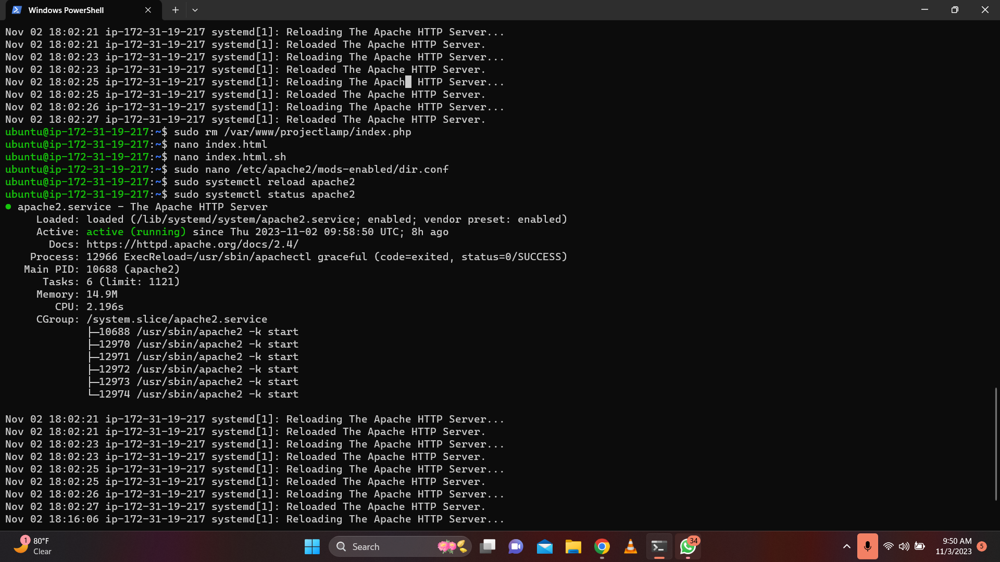
    - Our new website is now active, but the web root /var/www/projectlamp is still empty. Lets create an index.html file in that location so that we can test that the virtual host works as expected
    `sudo echo 'Hello LAMP from hostname' $(curl -s http://169.254.169.254/latest/meta-data/public-hostname) 'with public IP' $(curl -s http://169.254.169.254/latest/meta-data/public-ipv4) > /var/www/projectlamp/index.html`
    - Check your browser afterwards
    `http://<EC2-Public-IP-Address>:80`
7. Enable PHP on the website
    - With the default DirectoryIndex settings on Apache, a file named index.html will always take precedence over an index.php file.In case you want to change this behavior, you’ll need to edit the /etc/apache2/mods-enabled/dir.conf file and change the order in which the index.php file is listed within the DirectoryIndex directive:
    `sudo nano /etc/apache2/mods-enabled/dir.conf`
    - Clear the code there and replace with this
    ```
    <IfModule mod_dir.c>

    #Change this:

    #DirectoryIndex index.html index.cgi index.pl index.php index.xhtml index.htm

    #To this:

    DirectoryIndex index.php index.html index.cgi index.pl index.xhtml index.htm

    </IfModule>
    ```
    - After saving and closing the file, you will need to reload Apache so the changes take effect:
    `sudo systemctl reload apache2`
    - Create a new file named index.php inside your custom web root folder
    `nano /var/www/projectlamp/index.php`
    - Opens a blank file. Paste the following code in there:
    ```
    <?php

    phpinfo();
    ```
    - save and close the file, refresh the page and you will see a page similar to this:
    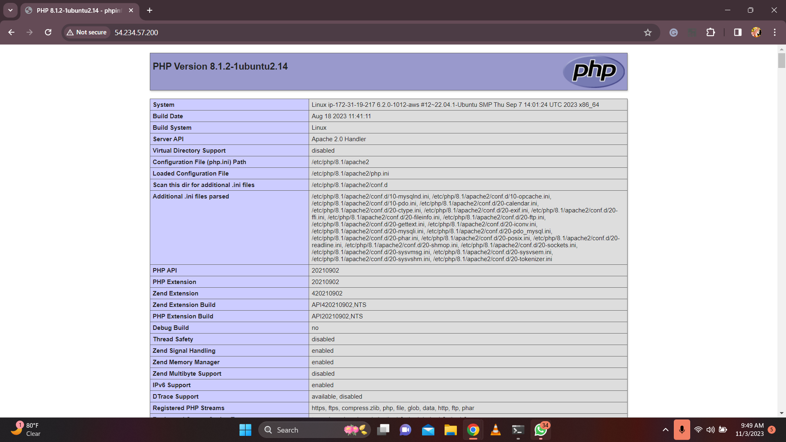
8. Remove the php page from the website when you are done because it contains some sensitive information.

`sudo rm /var/www/projectlamp/index.php`

# Congratulations!🎉   
