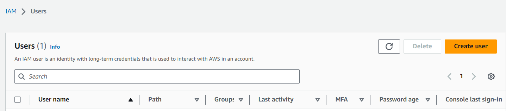

# CREATING AN AWS Ec2 INSTANCE WITH AN IAM USER

### IAM USER CREATION

1. Login into AWS console
2. Go to users and click on "Create user"
   
    
    
    
    
    
    
    

3. Setup your MFA on the aws console.
4. Log out of your aws console and login with your IAM user credentials
   
    
    
    
5. Click submit and you would be logged in to your aws console with your IAM user. Hover over Ec2 instance and click on "launch instance"

    
    
    
    
    
    
6. Click on launch instance

    

    # Congratulations! 
