# PROVISIONING AN EC2 INSTANCE WITH TERRAFORM (IAC)

1. Ensure your environment variables are properly set to run terraform
    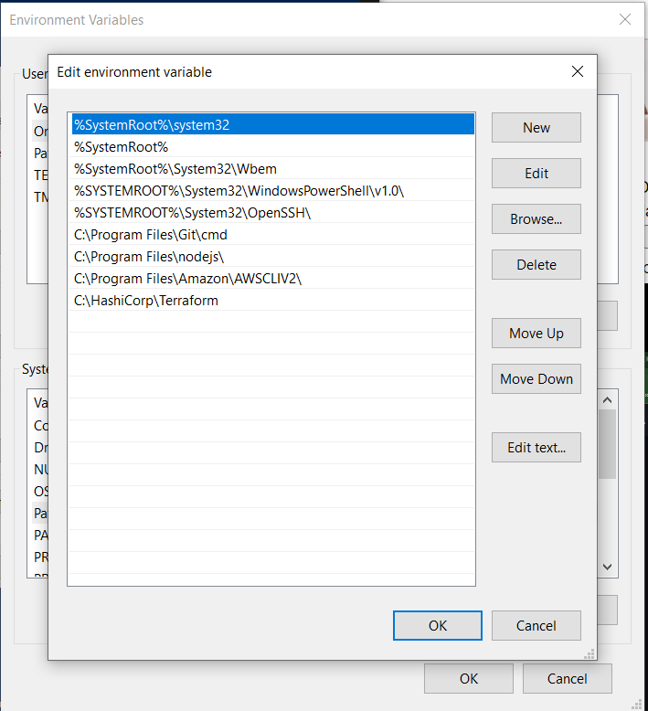
2. Open a terminal of your choice and run the following commands:
    - `terraform -help`
    - `terraform -v`
    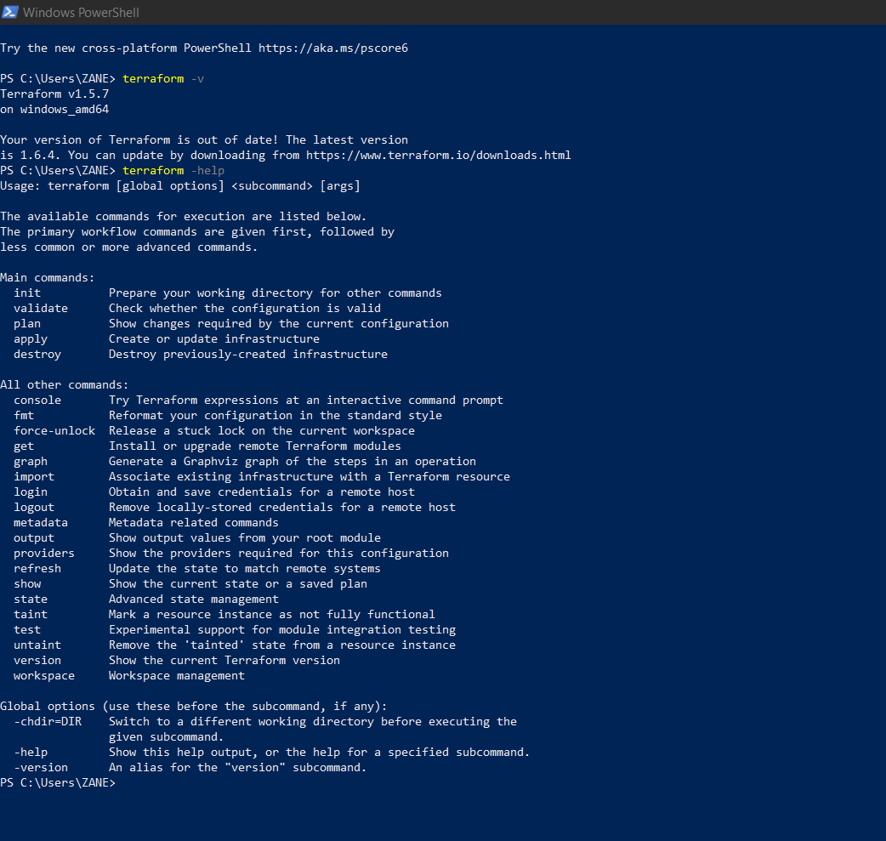
3. Create a directory , enter into the directory and open it on visual studio 
    
    ```
    mkdir directory_name
    cd directory_name
    code .
    ```
    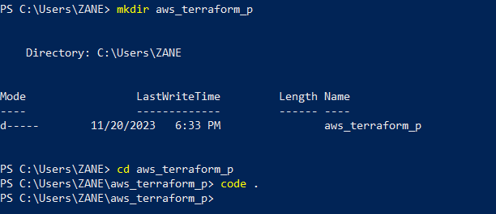

4. Create a file in your folder named "main.tf"
    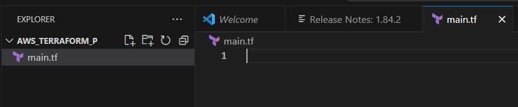

5. Copy and paste the following code:
    ```
    terraform {
     required_providers {
     aws = {
      source  = "hashicorp/aws"
      version = "~> 4.16"
      }
    }
     required_version = ">= 1.2.0"
    }

    provider "aws" {
    /* access_key = *****************
    secret_key = ************************
    */
    region = "us-east-2"

    }

    resource "aws_instance" "example_server" {
    ami           = "ami-0fb653ca2d3203ac1"
    instance_type = "t2.micro"

    tags = {
    Name = "ProjectExample"
      }
    }
    ```
    - NOTE: Where you have access_key and secret_key, you can replace it with your aws profile depending on which one you find convenient for you but I chose to use my aws access and secret key.
    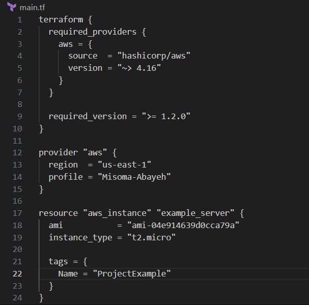

6. Save your file and open your terminal.
    - Run the following commands in your terminal
    - `terraform init`
    - `terraform fmt`
    - `terraform validate`
    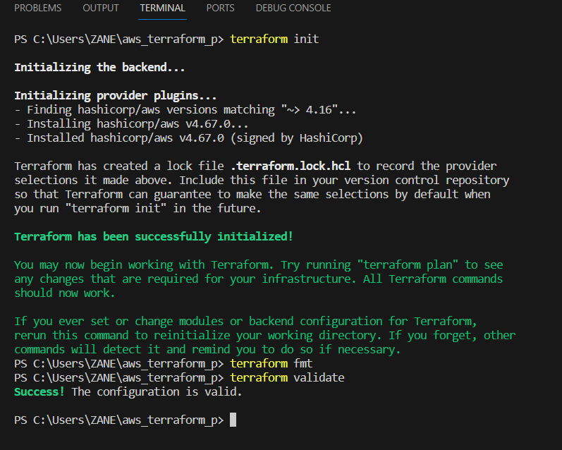
    - `terraform plan`
    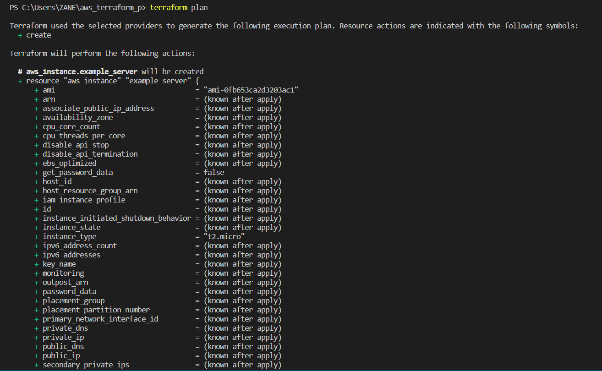
    - `terraform apply` 
    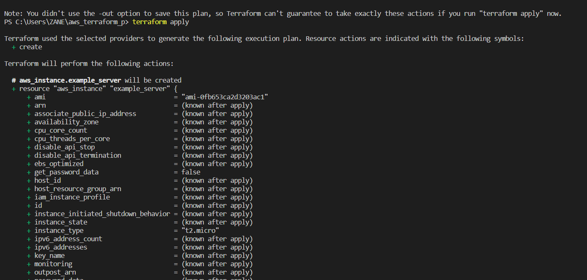
    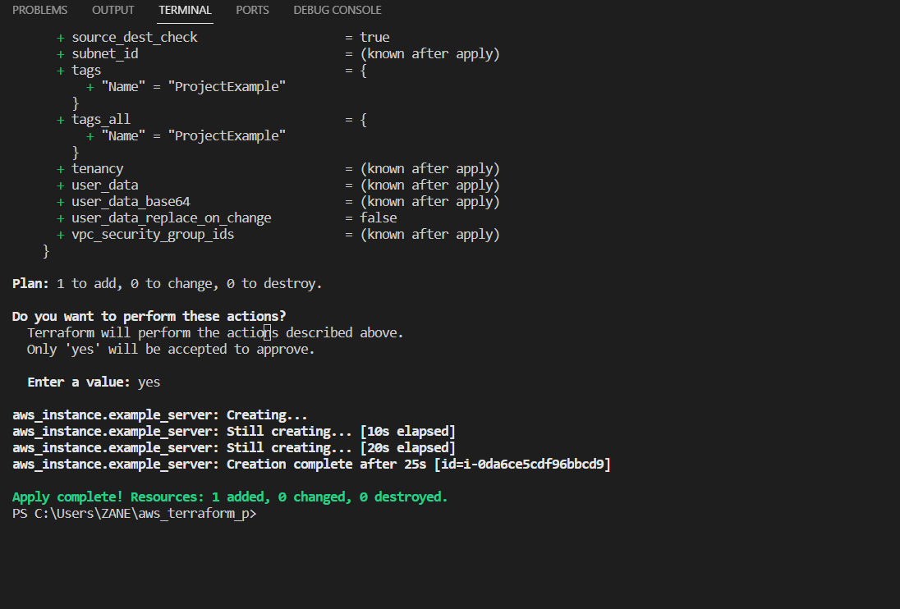
7. Open your aws console and sign in
    - Check the region that was specified in your "main.tf" file and select the region that was chosen
    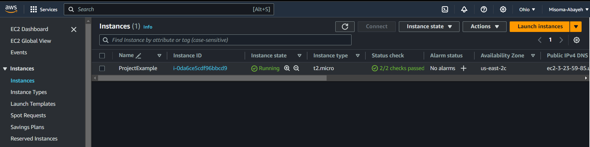
8. You can change the ami specified in your 'main.tf' file by replacing the current one with the new ami
    - 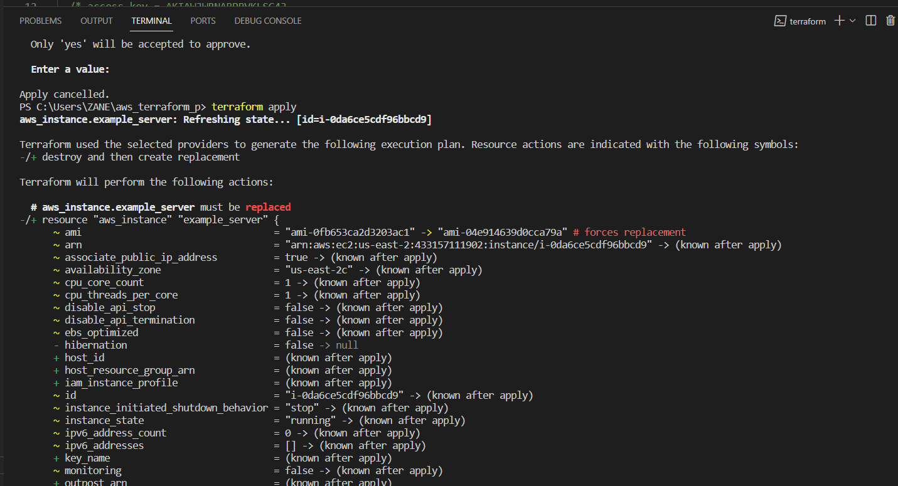
9. When you are done, you can destroy your Ec2 Instance. After doing this, you would notice that your instance has been terminated on your AWS console.
    - 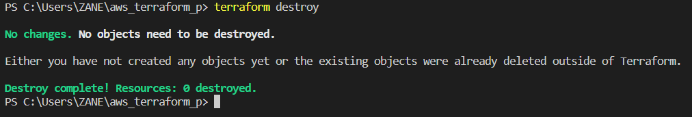
    - I already destroyed mine before now
# Congratulations !