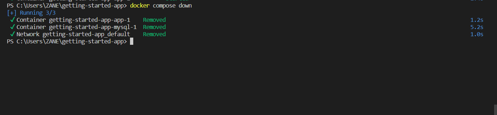

# DOCKER AND DOCKER COMPOSE
## Getting familiar with docker commands and how to use docker compose to run multiple containers
- Make sure your docker desktop is already running and you have signed into it.
- We would be cloning an existing repository for this project
    - `git clonehttps://github.com/docker/getting-started-app.git`
    - `cd getting-started-app`
    - `code .`
    
- Create a file named 'Dockerfile' and paste the following code there. Save afterwards.
    - 
     ```
    FROM node:18-alpine
    WORKDIR /app
    COPY . .
    RUN yarn install --production
    CMD ["node", "src/index.js"]
    EXPOSE 3000

     ```
    
- Open your terminal and run the following commands:
    - Build your container image
    - `docker buildx build \users\ZANE\getting-started-app`
    - Run your container 
    - `docker run -dp 127.0.0.1:3000:3000 getting-started`
    
    
        - Depending on the version, either of the commands would work.
    - Open your docker desktop to confirm your container is running
    
    - Go to your browser and put in the website address 
    `http://localhost:3000`
    
    - `docker ps`
    - Displays information about the running containers
    -  
- Create a network and a sql database to store items entered into the table.
    - `docker network create todo-app`
    ```
    docker run -d `
        --network todo-app --network-alias mysql `
        -v todo-mysql-data:/var/lib/mysql `
        -e MYSQL_ROOT_PASSWORD=1234 `
        -e MYSQL_DATABASE=todos `
        mysql:8.0
    ```
    
- Login into your mysql database
    - `docker exec -it <mysql-container-id> mysql -u root -p`
    - Enter root password '1234'
        - `Show Databases;`
    
- Clone a network repository and run the network container
    - `git clone https://github.com/nicolaka/netshoot.git` 
    - `docker run -it --network todo-app nicolaka/netshoot`
       - exit your network `exit`
    
- Connect your database to your network
    - 
    ```
    docker run -dp 127.0.0.1:3000:3000 `
    -w /app -v "$(pwd):/app" `
    --network todo-app `
    -e MYSQL_HOST=mysql `
    -e MYSQL_USER=root `
    -e MYSQL_PASSWORD=secret `
    -e MYSQL_DB=todos `
    node:18-alpine `
    sh -c "yarn install && yarn run dev"

    ```
    
        `http://localhost:3000`
    
    - Add some items 
    
    - Log back into your mysql server and confirm the items you added were there
        - `docker exec -it <mysql-container-id> mysql -p todos`
        - `select * from todo_items;`
    
- Everything works fine!
- Now lets make use of docker compose and see how easier it is to run multiple containers with docker compose
- We would stop and remove the containers we created.
    - You could leave the netshoot container if you choose to, I left mine in my case cause I was still going to use it later.
    
- Create a file named "compose.yaml" and paste the following code:
    - 
```
  services:
  app:
    image: node:18-alpine
    command: sh -c "yarn install && yarn run dev"
    ports:
      - 127.0.0.1:3000:3000
    working_dir: /app
    volumes:
      - ./:/app
    environment:
      MYSQL_HOST: mysql
      MYSQL_USER: root
      MYSQL_PASSWORD: secret
      MYSQL_DB: todos

  mysql:
    image: mysql:8.0
    volumes:
      - todo-mysql-data:/var/lib/mysql
    environment:
      MYSQL_ROOT_PASSWORD: secret
      MYSQL_DATABASE: todos

  volumes:
    todo-mysql-data:  

 ```
 - 
    - Run the docker compose command
        - `docker compose up -d`
    
    - Open the docker desktop and check for containers
    
    
    - To remove the containers, we run;
        - `docker compose down`
    


