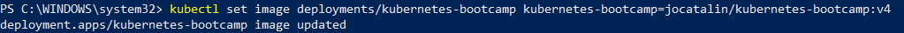

# BASIC COMMANDS IN KUBERNETES
- We would be making use of minkube to run our kubernetes commands
- Open any terminal of your choice
- Ensure your docker desktop is running
    - Ensure minikube is properly installed and start it with docker as its driver
        - `minikube start  --driver=docker`
        
    - Open kubernetes via minkube
        - `minikube dashboard`
        
    - Create a deployment
        - `kubectl create deployment kubernetes-bootcamp --image=gcr.io/google-samples/kubernetes-bootcamp:v1`
        - To view your deployments
        - `kubectl get deployments`
        
        - Check your kubernetes dashboard
        
        - Expose our application publicly
            - `kubectl expose deployment/kubernetes-bootcamp --type="NodePort" --port 8080`
            
            - Check your deployments as containers on docker desktop
            
    - Scale your deployment to 6 replicas
        - `kubectl scale deployments/kubernetes-bootcamp --replicas=6`
        
        
    - Update the version of your deployment to version 4
        - `kubectl set image deployments/kubernetes-bootcamp kubernetes-bootcamp=jocatalin/kubernetes-bootcamp:v2`
        
    - Stop and delete your deployment
        - `minikube stop`
        - `minikube delete`
        
        
